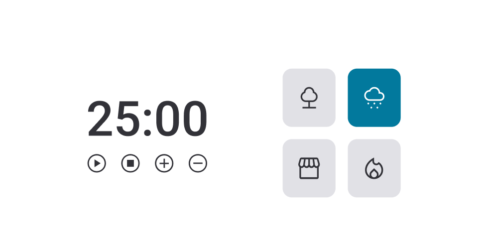

# Uso do JavaScript

### Essa tarefa faz parte do curso Explorer da [Rocketseat](https://www.rocketseat.com.br).

Nessa atividade foram abordadas as seguintes questões:

- Estrutura de dados HTML;
- Adicionado funções aos botões (cores e músicas ao clicar no elemento);
- Adicionado funções aos botões de play, pause, mais e menos (para aumentar ou reduzir o tempo em 5 minutos);
- Funções no JS;
- Manipulação da DOM;
- Uso de variáveis;

## 🔖 Layout 

O figma do projeto está disponível nesse [Link](<https://www.figma.com/file/LIFBecxpGdVXOnAqUe8FAb/Stage-05---Focus-Timer-2.0-(Copy)?node-id=0%3A1&mode=dev>).

